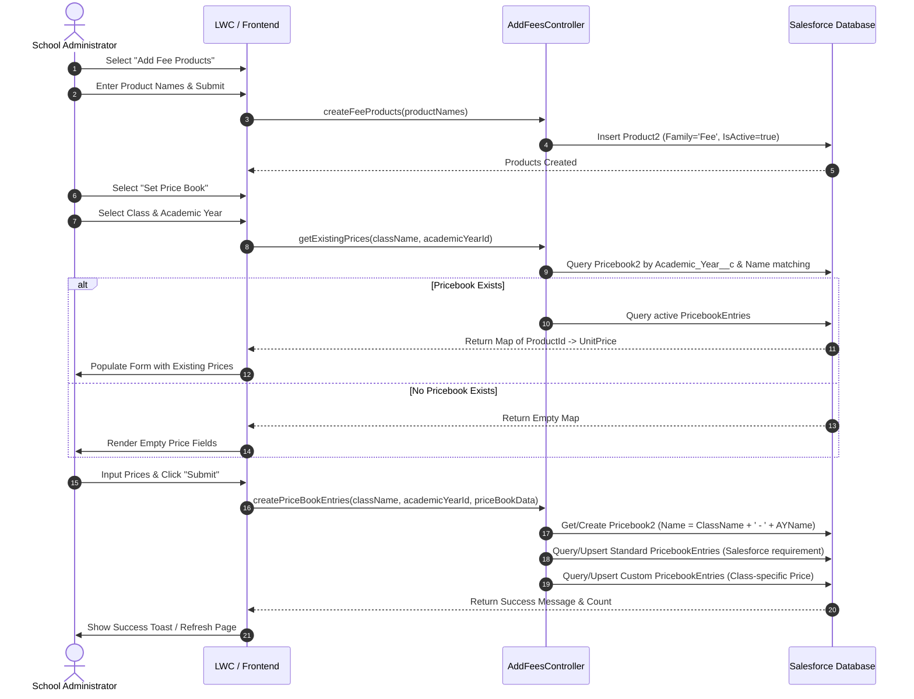
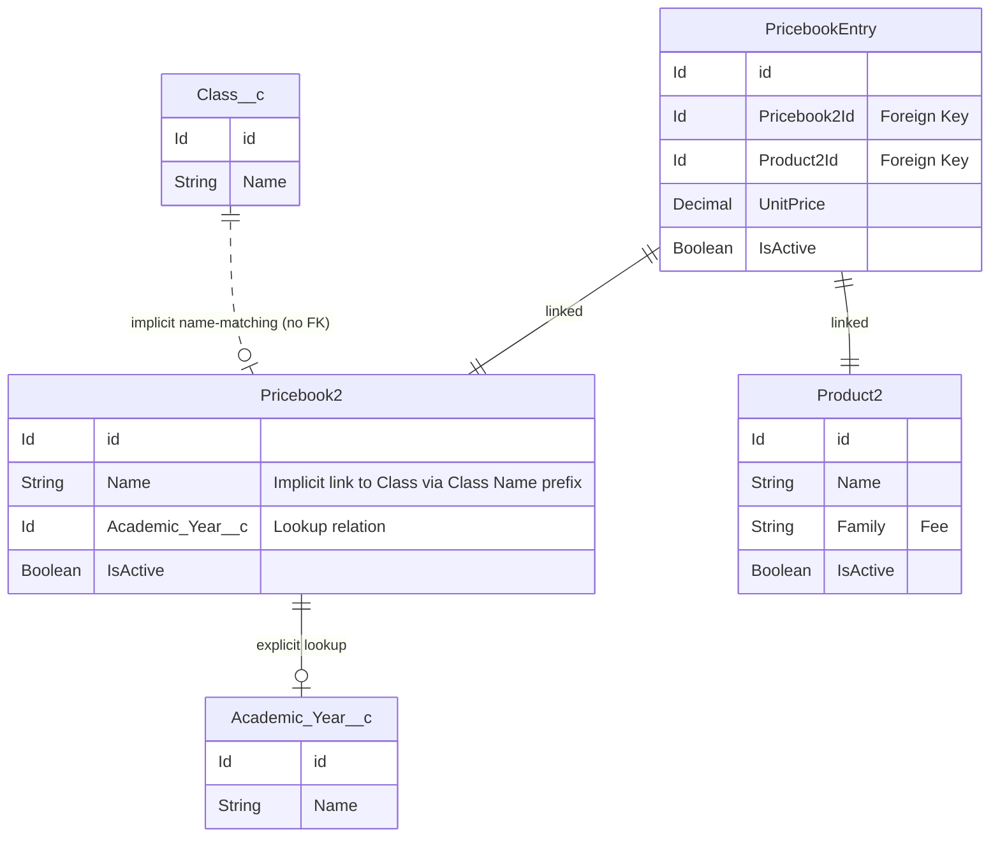

# Price Book Parity Validation: Salesforce vs. SaaS

This document presents a comprehensive parity validation of the **Price Book Management** module, comparing the original Salesforce package implementation against the proposed Next.js/NestJS/Prisma SaaS architecture.

---

## 1. Product Structure

* **Salesforce Object representing Fee Products**: `Product2` (Standard Object).
* **Fee Types Storage**: Stored as standard `Product2` records where `Family = 'Fee'` and `IsActive = true`.
* **Custom Objects Usage**: No custom objects are used for products/fee types. The package utilizes the native Salesforce Product catalog.
* **SaaS Mapping**: Maps directly to the `Product` model in Prisma.

---

## 2. Price Book Structure

* **Salesforce Object storing the Price Book**: `Pricebook2` (Standard Object).
* **Price Book Relationships**:
  * **Class**: **Implicit relationship via naming convention**. There is no Lookup or Master-Detail field pointing to `Class__c`. The controller queries the `Pricebook2` record where `Name LIKE ClassName + '%'`.
  * **Academic Year**: **Explicit lookup relationship**. Linked via a custom lookup field `Academic_Year__c` referencing `Academic_Year__c`.
  * **Tenant/School**: No tenant identifier exists in the Salesforce package (standard single-tenant org model).
* **SaaS Mapping**: Maps to the `Pricebook` model in Prisma.

---

## 3. Price Book Entry Structure

* **Salesforce Object storing pricing**: `PricebookEntry` (Standard Object).
* **Product Linking**: Links `Product2` to `Pricebook2` via `Product2Id` and `Pricebook2Id`.
* **Fee Activation/Deactivation**: Controlled via the `IsActive` boolean flag on `PricebookEntry`. Only entries with `IsActive = true` are retrieved.
* **Editing Existing Price Books**: In `createPriceBookEntries`, the system checks for existing standard and custom `PricebookEntry` records. If found, it updates the `UnitPrice` if modified; if not found, it inserts new entries.

---

## 4. User Flow Validation

The diagram below illustrates the exact end-to-end user flow in the Salesforce package:



---

## 5. Relationship Diagrams: Salesforce vs. SaaS

### Salesforce Package Relationship Model
Salesforce utilizes an **implicit string-matching relationship** between Classes and Price Books:



### Proposed SaaS Relationship Model (Recommended)
The SaaS architecture introduces a **strongly-typed ID-based relationship** between Classes and Pricebooks to ensure referential integrity:

```mermaid
erDiagram
    Class {
        String id PK
        String name
        String tenantId
    }
    AcademicYear {
        String id PK
        String name
        String tenantId
    }
    Pricebook {
        String id PK
        String name
        String academicYearId FK
        String classId FK
        String tenantId FK
        Boolean isActive
    }
    Product {
        String id PK
        String name
        String productCode
        String tenantId FK
        Boolean isActive
    }
    PricebookEntry {
        String id PK
        String pricebookId FK
        String productId FK
        Decimal unitPrice
        String tenantId FK
        Boolean isActive
    }

    Pricebook ||--o| AcademicYear : "academicYearId"
    Pricebook ||--o| Class : "classId"
    PricebookEntry ||--|| Pricebook : "pricebookId"
    PricebookEntry ||--|| Product : "productId"
```

---

## 6. Gap Analysis

| Feature | Salesforce Package | Proposed SaaS Implementation | Parity Evaluation |
| :--- | :--- | :--- | :--- |
| **Class Relationship** | Name-based string matching. Fragile if class names are updated. | ID-based foreign key relation (`classId`). Strong referential integrity. | **SaaS is Superior**. Relational constraints prevent orphan records. |
| **Standard Price Book** | Required. Product must have a Standard Pricebook entry before custom pricebook entries can be created. | Not required. Direct entries in class-specific Pricebooks. | **SaaS is Simplified**. Eliminates redundant standard entries. |
| **Data Isolation** | Single Org model. No tenant separation required. | Multi-tenant schema using `tenantId` across all models. | **Parity Achieved** (via multi-tenancy requirements). |
| **Edit/Upsert behavior** | Upserts standard & custom entries. | Will query database by `(classId, academicYearId, tenantId)` and upsert. | **Parity Reached** (once backend service is implemented). |

---

## 7. Final Schema Recommendation

### Recommendation: **PROCEED with the Prisma Schema Change**

Establishing `classId` in `Pricebook` is **strongly recommended** for the SaaS implementation instead of trying to replicate Salesforce's name-based matching. 

#### Rationale:
1. **Avoids Fragile Logic**: In Salesforce, name-based matching is used because `Pricebook2` is a standard object, and linking standard objects to managed package custom objects (`Class__c`) in a packaged product is often avoided due to packaging restrictions and user licensing boundaries. We do not have this restriction in our independent PostgreSQL schema.
2. **Prevents Orphan Records**: If a school administrator renames a Class from `"Class 10"` to `"Grade 10"`, a name-based lookup would lose the link to all previously saved fee entries. A relational foreign key (`classId`) ensures that the relationship is maintained across renames.
3. **Optimized Queries**: Relational indexes on `(classId, academicYearId, tenantId)` allow highly efficient database retrievals when loading existing prices compared to string-prefix matching.
